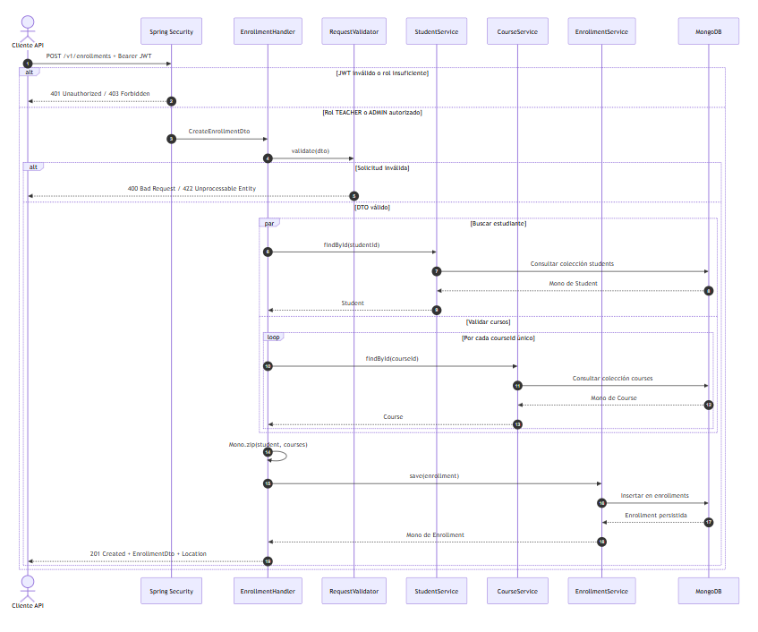
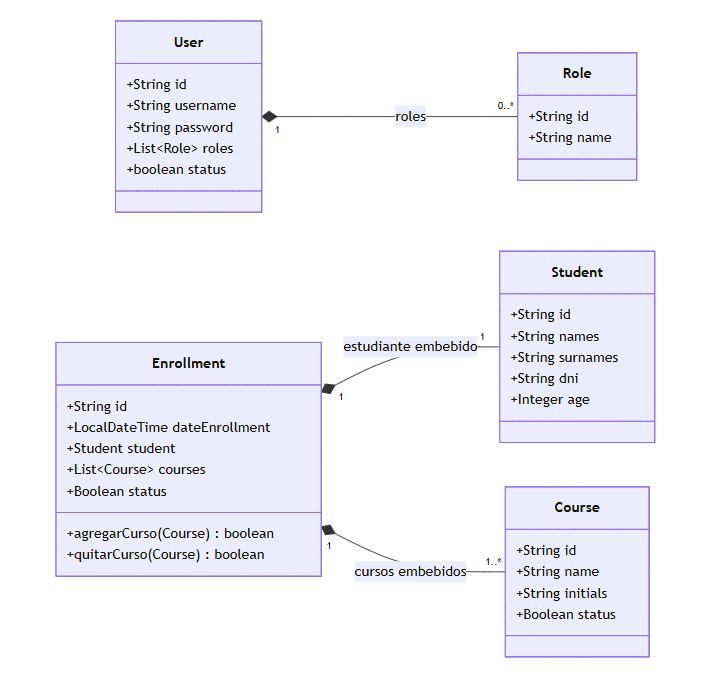

# 🎓 Spring WebFlux Enrollment API

## 📋 Descripción del Proyecto

API REST reactiva para gestión de matrículas estudiantiles desarrollada con **Spring WebFlux** y **MongoDB**. El sistema implementa autenticación JWT y autorización basada en roles para gestionar estudiantes, cursos y matrículas.

### 🚀 Características Principales

- **Arquitectura Reactiva** con Spring WebFlux y Project Reactor
- **Autenticación JWT** con tokens seguros
- **Autorización por Roles** (ADMIN, TEACHER, STUDENT)
- **Base de Datos NoSQL** con MongoDB
- **API REST** con validaciones y manejo de errores
- **Documentación OpenAPI** con Swagger UI
- **Containerización** con Docker y Docker Compose

## 🧭 Arquitectura y Diagramas

### Secuencia de Creación de una Matrícula

El flujo valida primero el JWT y los permisos del usuario. Después valida la solicitud, consulta de forma reactiva el estudiante y los cursos, combina ambos resultados con `Mono.zip` y persiste la matrícula en MongoDB.

<p align="center">
  
</p>

### UML del Modelo de Dominio

Las matrículas contienen los datos del estudiante y de uno o más cursos. Los usuarios, por su parte, reciben los roles utilizados por Spring Security para autorizar cada operación.

<p align="center">
  
</p>

## 🛠️ Tecnologías Utilizadas

### Backend
- **Java 21** - Lenguaje de programación
- **Spring Boot 3.x** - Framework de aplicación
- **Spring WebFlux** - Programación reactiva
- **Spring Security** - Autenticación y autorización
- **Spring Data MongoDB** - Persistencia de datos
- **Project Reactor** - Programación reactiva

### Base de Datos
- **MongoDB 7.0** - Base de datos NoSQL
- **Mongo Express** - Interfaz web para MongoDB

### Herramientas
- **Maven** - Gestión de dependencias
- **Lombok** - Reducción de código boilerplate
- **ModelMapper** - Mapeo entre DTOs y entidades
- **JJWT** - Manejo de tokens JWT
- **Docker** - Containerización
- **Swagger/OpenAPI** - Documentación de API

## 🚀 Instrucciones de Ejecución

### 📋 Prerrequisitos

- **Java 21** o superior
- **Maven 3.9+** o superior
- **Docker** y **Docker Compose** (opcional)
- **MongoDB** (si ejecutas localmente)

### 🐳 Ejecución con Docker (Recomendado)

#### 1. Clonar el repositorio
```bash
git clone <url-del-repositorio>
cd spring-webflux-enrollment
```

#### 2. Ejecutar con Docker Compose
```bash
# Construir y ejecutar todos los servicios
docker-compose up --build -d

# Ver logs de la aplicación
docker-compose logs -f app

# Ver logs de MongoDB
docker-compose logs -f mongodb
```

#### 3. Acceder a los servicios
- **API**: http://localhost:8080
- **Swagger UI**: http://localhost:8080/swagger-ui.html
- **Mongo Express**: http://localhost:8081
- **MongoDB**: localhost:27017

#### 4. Detener servicios
```bash
docker-compose down
```

### 💻 Ejecución Local

#### 1. Configurar MongoDB
```bash
# Instalar MongoDB localmente o usar Docker
docker run -d -p 27017:27017 --name mongodb mongo:7.0

# O ejecutar MongoDB como servicio en tu sistema
```

#### 2. Configurar variables de entorno
```bash
# Modificar el properties
export SPRING_DATA_MONGODB_URI=mongodb://localhost:27017/enrollment_db
export JWT_SECRET=tu_clave_secreta_muy_segura
export JWT_EXPIRATION=86400000
```

#### 3. Ejecutar la aplicación
```bash
# Opción 1: Con Maven
mvn spring-boot:run

# Opción 2: Compilar y ejecutar JAR
mvn clean package -DskipTests
java -jar target/*.jar
```

#### 4. Acceder a la API
- **API**: http://localhost:8080
- **Swagger UI**: http://localhost:8080/swagger-ui.html

## 🔐 Autenticación y Usuarios

### Usuarios por Defecto
- **admin** / admin123 (Rol: ADMIN)

---

Última actualización del proyecto: **24 de agosto de 2025**.
